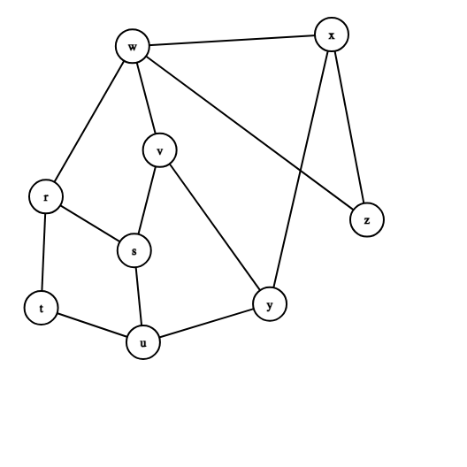

### Example

[Graph Editor](https://csacademy.com/app/graph_editor/)
```
<Graph indexType="custom" height="400" width="400" nodes={[{label:"r",center:{x:42.6,y:181.9}},{label:"s",center:{x:124.2,y:231.7}},{label:"t",center:{x:38.1,y:284.7}},{label:"u",center:{x:132.5,y:316.6}},{label:"v",center:{x:147.8,y:138.9}},{label:"w",center:{x:122.6,y:42.8}},{label:"x",center:{x:306.9,y:31.9}},{label:"y",center:{x:249.6,y:281.2}},{label:"z",center:{x:339.6,y:203.4}}]} edges={[{source:0,target:2},{source:0,target:1},{source:0,target:5},{source:1,target:3},{source:1,target:4},{source:2,target:3},{source:3,target:7},{source:5,target:4},{source:4,target:7},{source:5,target:6},{source:5,target:8},{source:6,target:7},{source:6,target:8}]} />
```

