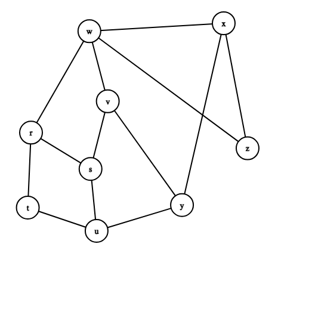

### Example

[Graph Editor](https://csacademy.com/app/graph_editor/)

```
<Graph indexType="custom" height="400" width="400" nodes={[{label:"r",center:{x:42.6,y:181.9}},{label:"s",center:{x:124.2,y:231.7}},{label:"t",center:{x:38.1,y:284.7}},{label:"u",center:{x:132.5,y:316.6}},{label:"v",center:{x:147.8,y:138.9}},{label:"w",center:{x:122.6,y:42.8}},{label:"x",center:{x:306.9,y:31.9}},{label:"y",center:{x:249.6,y:281.2}},{label:"z",center:{x:339.6,y:203.4}}]} edges={[{source:0,target:2},{source:0,target:1},{source:0,target:5},{source:1,target:3},{source:1,target:4},{source:2,target:3},{source:3,target:7},{source:5,target:4},{source:4,target:7},{source:5,target:6},{source:5,target:8},{source:6,target:7},{source:6,target:8}]} />
```




```
use std::collections::{HashMap, VecDeque};
use std::rc::Rc;
use std::cell::RefCell;

#[derive(Debug, Clone, PartialEq, Eq, Hash)]
pub struct Vertex {
    label: char,
    visited: bool,
    dist: i32,
    pi: Option<Rc<RefCell<Vertex>>>,
}

impl Vertex {
    pub fn new(label: char) -> Self {
        Self {
            label,
            visited: false,
            dist: i32::MAX,
            pi: None,
        }
    }

    pub fn with_params(label: char, visited: bool, dist: i32, pi: Option<Rc<RefCell<Vertex>>>) -> Self {
        Self {
            label,
            visited,
            dist,
            pi,
        }
    }

    pub fn to_string(&self) -> String {
        let pi_label = match &self.pi {
            Some(pi) => pi.borrow().label,
            None => '-',
        };
        format!(
            "Vertex{{label={}, visited={}, dist={}, pi={}}}",
            self.label, self.visited, self.dist, pi_label
        )
    }
}

pub struct Graph {
    vertices: HashMap<char, Rc<RefCell<Vertex>>>,
    edges: Vec<(char, char)>,
}

impl Graph {
    pub fn new(edges: Vec<(char, char)>) -> Self {
        Self {
            vertices: HashMap::new(),
            edges,
        }
    }

    pub fn shortest_path(&mut self, source: char, target: char) -> Vec<Rc<RefCell<Vertex>>> {
        if source == target {
            return vec![Rc::new(RefCell::new(Vertex::with_params(target, true, 0, None)))];
        }
        self.bfs(source, Some(target));
        let mut path = vec![];
        self.print_path(source, target, &mut path);
        path.reverse();
        path
    }

    fn print_path(&self, source: char, target_label: char, path: &mut Vec<Rc<RefCell<Vertex>>>) {
        let mut current = self.vertices.get(&target_label).map(|v| Rc::clone(v));
        while let Some(vertex) = current {
            path.push(Rc::clone(&vertex));
            if vertex.borrow().label == source {
                break;
            }
            current = vertex.borrow().pi.as_ref().map(|pi| Rc::clone(pi));
        }
    }

    pub fn bfs(&mut self, source: char, target: Option<char>) {
        let mut adj: HashMap<char, Vec<Rc<RefCell<Vertex>>>> = HashMap::new();

        for (src, dest) in &self.edges {
            let src_vertex = self.vertices.entry(*src).or_insert_with(|| Rc::new(RefCell::new(Vertex::new(*src))));
            let dest_vertex = self.vertices.entry(*dest).or_insert_with(|| Rc::new(RefCell::new(Vertex::new(*dest))));

            adj.entry(*src).or_default().push(Rc::clone(dest_vertex));
            adj.entry(*dest).or_default().push(Rc::clone(src_vertex));
        }

        let src_vertex = self.vertices.get(&source).expect("Source vertex not found");
        src_vertex.borrow_mut().visited = true;
        src_vertex.borrow_mut().dist = 0;

        let mut queue = VecDeque::new();
        queue.push_back(Rc::clone(src_vertex));

        while let Some(u) = queue.pop_front() {
            let u_vertex = u.borrow();

            if let Some(neighbors) = adj.get(&u_vertex.label) {
                for v in neighbors {
                    let mut v_vertex = v.borrow_mut();
                    if !v_vertex.visited {
                        v_vertex.visited = true;
                        v_vertex.dist = u_vertex.dist + 1;
                        v_vertex.pi = Some(Rc::clone(&u));

                        if target == Some(v_vertex.label) {
                            return;
                        }
                        queue.push_back(Rc::clone(v));
                    }
                }
            }
        }
    }
}

fn main() {
    // Example usage
    let edges = vec![('A', 'B'), ('B', 'C'), ('C', 'D'), ('D', 'E')];
    let mut graph = Graph::new(edges);
    let path = graph.shortest_path('A', 'D');
    for vertex in path {
        println!("{}", vertex.borrow().to_string());
    }
}
```
